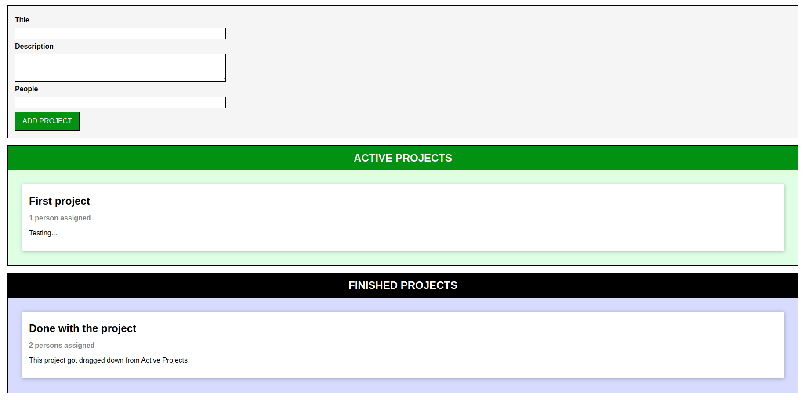

# Project Manager

A simple drag and drop project created with TypeScript where you can create your own project with title, description and a x amount of people participating. You can drag and drop the projects between active and finished projects.

### Presentation of the project:

- Create a project with title, description and x persons.
- Drag and drop between active and finished.

Run following command in terminal to open the project
$ npm start

### Sources
Udemy: Understanding TypeScript - 2021 Edition
Link: https://www.udemy.com/course/understanding-typescript/